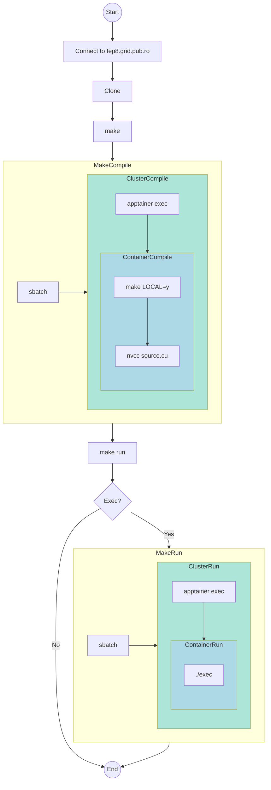

# Infrastructură laborator

În decursul acestui tutorial identificatorul `prenume.numeID` reprezintă numele
de utilizator cu care vă conectați prin OAuth (login.upb.ro) pe Moodle, de
exemplu.

## Utilizând cluster-ul

**ATENȚIE!** Prima rulare a lui `make` da descărca o imagine de Docker și va
construi un Singularity Image Format (SIF) file în destul de mult timp.

1. Conectați-vă mai întâi pe `fep8.grid.pub.ro`.
  Urmăriți următorul tutorial ca să vă puteți conectata [fără parolă] de pe
  **dispozitivele personale**.
    ```bash
    $ ssh prenume.numeID@fep8.grid.pub.ro
    ```
1. Clonați acest repository.
    Observație: mențineți clona la curent cu schimbările recente (e.g. `git
    pull`).
    ```bash
    [prenume.numeID@fep8 ~]$ git clone https://gitlab.cs.pub.ro/asc/asc-public.git
    ```
1. Navigați către aplicația cu care lucrați.
    ```bash
    [prenume.numeID@fep8 ~]$ cd asc-public/labs/cuda/hello
    ```
1. (Descărcați fișierul SIF,) Compilați și rulați.
    ```bash
    [prenume.numeID@fep8 hello]$ make
    Submitted batch job 339550 # aici s-a descărcat fișierul SIF
    Submitted batch job 339551 # aici s-a compilat programul vostru
    [prenume.numeID@fep8 hello]$ cat slurm-339550.out
    ...
    INFO:    Creating SIF file...
    ...
    [prenume.numeID@fep8 hello]$ cat slurm-339551.out
    make[1]: Entering directory `/export/home/acs/stud/m/prenume.numeID/asc-public/labs/cuda/hello'
    nvcc   hello.cu -o hello
    make[1]: Leaving directory `/export/home/acs/stud/m/prenume.numeID/asc-public/labs/cuda/hello'
    [prenume.numeID@fep8 hello]$ make run
    Submitted batch job 339559
    [prenume.numeID@fep8 hello]$ cat slurm-339559.out
    [HOST] Hello from the host!
    [HOST] You have 1 CUDA-capable GPU(s)
    [GPU] Hello from the GPU!
    [GPU] Hello from the GPU!
    [GPU] The value is 11
    [GPU] The value is 11
    [prenume.numeID@fep8 hello]$ make clean
    rm -f hello slurm-*.out slurm-*.err
    ```
1. Ajustați parametrii de rulare din [Makefile](Makefile) în favoarea voastră.
    ```bash
    make BUILD_TIME=00:05:00
    # sau
    make RUN_TIME=00:05:00
    ```
### Stând la coadă

Dacă comanda voastră necesită mai mult timp de rulare,
veți vedea că fișierul `slurm-ID.out` e completat parțial, linie cu linie.
Folosiți `watch` (`man 1 watch`), ca să nu rulați `cat` de mai multe ori.
```bash
[prenume.numeID@fep8 hello]$ watch cat slurm-339347.out
```

*Notă*. În caz în care fișierul `slurm-ID.out` nu a fost creat, verificați
statusul job-ului vostru.
```bash
[prenume.numeID@fep8 hello]$ squeue -j 339347
         JOBID PARTITION     NAME     USER ST       TIME  NODES NODELIST(REASON)
        339347        xl     wrap cucu.bau PD       0:00      1 (Priority)
```

Sau verificați statusul mai multor job-uri ale aceluiași utilizator.
```bash
[prenume.numeID@fep8 hello]$ squeue -u alexandra.alexe1305
         JOBID PARTITION     NAME     USER ST       TIME  NODES NODELIST(REASON)
        348354      ucsx     wrap prenume. PD       0:00      1 (QOSMaxJobsPerUserLimit)
        348351      ucsx     wrap prenume. PD       0:00      1 (QOSMaxJobsPerUserLimit)
        348310      ucsx     wrap prenume.  R       1:10      1 ucsx-ncit-wn26
[prenume.numeID@fep8 hello]$ squeue --me
```

### Debugging, memchecking and profiling

Scrieți-vă comenzile de gdb în `gdb_commands.txt` și rulați comanda de mai jos.
Citiți mai multe [aici](arch/tutorials/debug/README.md).

Mărturisire. Momentan debugging-ul merge doar cu `module load`.

```bash
[prenume.numeID@fep8 proj]$ cat Makefile
...
LOAD_PREFIX := module load libraries/cuda-11.4;
...
$ make run RUN_CMD='cuda-gdb -x gdb_commands.txt ./$(EXEC)'
```

Citiți mai multe despre memchecking [aici](arch/tutorials/debug/README.md).
```bash
[prenume.numeID@fep8 proj]$ make run RUN_CMD='compute-sanitizer ./$(EXEC)'
```

Citiți mai multe despre profiling [aici](arch/README.md)

Mărturisire. Momentan `ncu` funcționează doar pe partiția `ucsx` cu imaginea
de Docker `12.3.2`.

```bash
[prenume.numeID@fep8 proj]$ make run RUN_CMD='ncu --print-details all ./$(EXEC)'
```

### Editorul potrivit

Pe fep aveți instalat `nano` și `vim`.

Opțional, puteți să vă montați subdirectorul `labs` din clona
voastră a acestui repository pe mașina locală. Ajutați căile din instrucțiunile
de mai jos la nevoie.

```bash
[prenume.numeID@fep8 labs]$ pwd
/export/home/acs/stud/m/prenume.numeID/asc-public/labs
[prenume.numeID@fep8 labs]$ exit
# local machine commands from now on
$ mkdir fep-local-mnt-point
$ sudo sshfs prenume.numeID@fep8.grid.pub.ro:/export/home/acs/stud/m/prenume.numeID/asc-public/labs fep-local-mnt-point -o follow_symlinks,allow_other
```

Nu vă recomandăm montarea folderului `.git` pe mașina locală.

### În spatele cortinei

Urmăriți diagrama de mai jos pentru a înțelege care este șirul de acțiuni
executate în spatele exemplului de mai sus.


## Utilizând procesorul grafic personal

Urmăriți instrucțiunile pe o mașină UNIX-like. Vedeți instrucțiunile de instalare
pentru [Linux](https://docs.nvidia.com/cuda/cuda-installation-guide-linux/). În
cazul în care folosiți MacOS sau Windows vă rugăm să creați un merge request cu
pașii pe care i-ați urmat.

### Linux

1. Clonați acest repository.
    Observație: mențineți clona la curent cu schimbările recente (e.g. `git pull`)
    ```bash
    $ git clone https://gitlab.cs.pub.ro/asc/asc-public.git
    ```
2. Navigați către aplicația cu care lucrați.
    ```bash
    $ cd asc-public/labs/cuda/hello
    ```
3. Compilați sursele.
    ```bash
    $ make LOCAL=y
    nvcc   hello.cu -o hello
    $ ./hello
    [HOST] Hello from the host!
    [HOST] You have 1 CUDA-capable GPU(s)
    [GPU] Hello from the GPU!
    [GPU] Hello from the GPU!
    [GPU] The value is 11
    [GPU] The value is 11
    ```
    **Observație**! Dacă întâmpinați următoarea problemă:

    > ERROR: No supported gcc/g++ host compiler found, but clang-14 is available.
    > Use 'nvcc -ccbin clang-14' to use that instead.

    Rulați așa comanda de `make`:
    ```bash
    make NVCC="nvcc -ccbin clang-14" LOCAL=y
    ```

[fără parolă]: https://askubuntu.com/questions/46930/how-can-i-set-up-password-less-ssh-login
